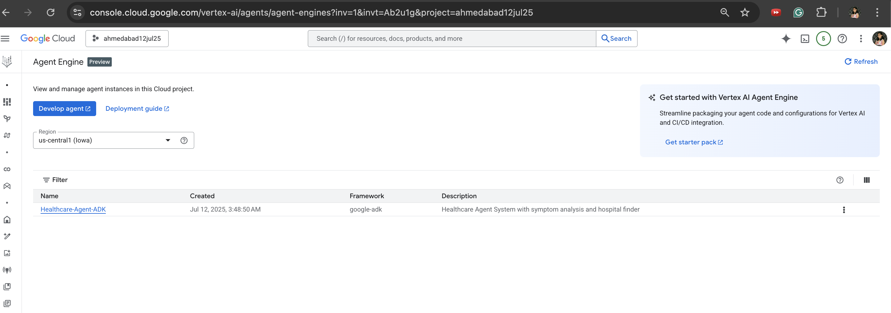
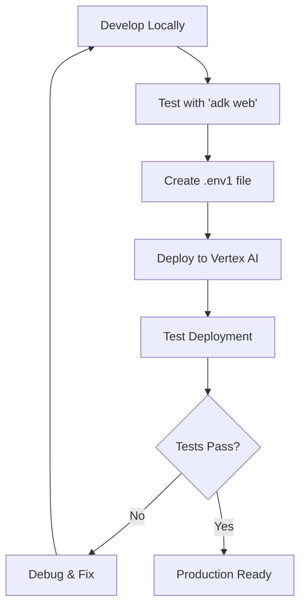

# Healthcare Agent Deployment Guide

A comprehensive guide for deploying the Healthcare Agent System to Google Cloud Vertex AI using the ADK (Agent Development Kit).

## 📋 Table of Contents

1. [Prerequisites](#prerequisites)
2. [Configuration Setup](#configuration-setup)
3. [Deployment Commands](#deployment-commands)
4. [Testing Your Deployment](#testing-your-deployment)
5. [Managing Deployments](#managing-deployments)
6. [Troubleshooting](#troubleshooting)
7. [Best Practices](#best-practices)

## 🚀 Prerequisites

### Required Services

1. **Google Cloud Project** with billing enabled
2. **Vertex AI API** enabled
3. **Cloud Storage** bucket for staging
4. **Google Places API** enabled
5. **Python 3.9+** installed locally

### Required Permissions

Your Google Cloud account needs these IAM roles:
- `Vertex AI Administrator` or `Vertex AI User`
- `Storage Admin` or `Storage Object Admin`
- `Service Account User` 


## 🔧 Configuration Setup

### 1. Create .env1 File

Create a `.env1` file in your project root with the following configuration:

```env
# Google Cloud Configuration
GOOGLE_CLOUD_PROJECT=your-project-id
GOOGLE_CLOUD_LOCATION=us-central1
GOOGLE_CLOUD_STORAGE_BUCKET=your-staging-bucket

# API Keys
GOOGLE_PLACES_API_KEY=your-places-api-key
GOOGLE_API_KEY=your-google-ai-api-key

# Deployment Configuration
DEPLOYMENT_NAME=Healthcare-Agent-ADK
DEPLOYMENT_DESCRIPTION=Healthcare Agent System with symptom analysis and hospital finder
```


### 2. Setting Up Google Cloud Resources

#### Create a Storage Bucket
```bash
# Replace YOUR_PROJECT_ID and YOUR_BUCKET_NAME
gsutil mb gs://YOUR_BUCKET_NAME
gsutil versioning set on gs://YOUR_BUCKET_NAME
```

#### Enable Required APIs
```bash
gcloud services enable aiplatform.googleapis.com
gcloud services enable storage.googleapis.com
gcloud services enable places-backend.googleapis.com
```

## 📦 Deployment Commands

### Create New Deployment

```bash
python deploy.py create
```

**Expected Output:**
```
🏥 Healthcare Agent Deployment System
==================================================
📋 Configuration:
   Project ID: your-project-id
   Location: us-central1
   Bucket: your-staging-bucket
   Deployment Name: Healthcare-Agent-ADK

🚀 Creating new healthcare agent deployment...
📋 Environment variables: ['GOOGLE_PLACES_API_KEY', 'GOOGLE_API_KEY']
✅ Created remote agent: projects/123456789/locations/us-central1/reasoningEngines/1234567890123456789
📋 Resource ID: 1234567890123456789

🎉 Deployment successful!
💡 To test: python deploy.py test 1234567890123456789
💡 To delete: python deploy.py delete 1234567890123456789
```

### Test Deployment

```bash
python deploy.py test <resource_id>
```

**Example:**
```bash
python deploy.py test 1234567890123456789
```

### Delete Deployment

```bash
python deploy.py delete <resource_id>
```

**Example:**
```bash
python deploy.py delete 1234567890123456789
```

## 🧪 Testing Your Deployment

### Vertex AI Agent Engine Dashboard


- Once your agent is deployed, you can find it listed under **Vertex AI > Agent Engine** in the Google Cloud Console.
- Clicking on the agent engine entry opens a detailed view where you can:
  - Monitor **telemetry** and **tracking logs** for debugging and performance insights.
  - View **resource allocation**, including CPU, memory, and scaling configuration.
  - Track the **active and historical sessions** handled by the agent.
  - Check the **deployment status** and any recent updates or errors.
  - Access configuration settings and endpoints for further integration.

> This view is essential for monitoring the health and usage of your deployed agent in production.

### Automated Test

The deployment script includes an automated test that sends a sample healthcare query:

```
"I have a fever and headache. Can you help me find nearby hospitals?"
```

### Manual Testing

You can also test your deployment manually using the Vertex AI console or by integrating with your applications.

### Expected Test Response

The healthcare agent should:
1. Analyze the symptoms (fever, headache)
2. Provide preliminary assessment
3. Find nearby hospitals using auto-location detection
4. Provide hospital details and emergency guidance

## 🛠️ Managing Deployments

### List Existing Deployments

```bash
gcloud ai reasoning-engines list --location=us-central1
```

### View Deployment Details

```bash
gcloud ai reasoning-engines describe RESOURCE_ID --location=us-central1
```

### Monitor Deployment Logs

```bash
gcloud logging read "resource.type=vertex_ai_reasoning_engine" --limit=50
```

### Update Deployment

To update an existing deployment:
1. Delete the old deployment
2. Create a new deployment with updated code

```bash
python deploy.py delete <old_resource_id>
python deploy.py create
```

## 🔍 Troubleshooting

### Common Issues

#### 1. Missing .env1 File
**Error:** `❌ .env1 file not found!`

**Solution:** Create a `.env1` file with required configuration variables.

#### 2. Missing Environment Variables
**Error:** `❌ Missing required environment variables in .env1`

**Solution:** Ensure all required variables are set in your `.env1` file:
- `GOOGLE_CLOUD_PROJECT`
- `GOOGLE_CLOUD_LOCATION`
- `GOOGLE_CLOUD_STORAGE_BUCKET`
- `GOOGLE_PLACES_API_KEY`

#### 3. Permission Denied
**Error:** `403 Forbidden` or permission errors

**Solution:** 
- Verify your Google Cloud authentication: `gcloud auth list`
- Check IAM permissions for Vertex AI and Storage
- Ensure billing is enabled on your project

#### 4. API Not Enabled
**Error:** `API not enabled` errors

**Solution:**
```bash
gcloud services enable aiplatform.googleapis.com
gcloud services enable storage.googleapis.com
gcloud services enable places-backend.googleapis.com
```

#### 5. Staging Bucket Issues
**Error:** `Bucket not found` or `Access denied`

**Solution:**
- Create the bucket: `gsutil mb gs://YOUR_BUCKET_NAME`
- Check bucket permissions and ensure it's in the same project

### Debug Mode

To get more detailed output, you can modify the deployment script to include debug information:

```python
# Add this to the beginning of main() function
import logging
logging.basicConfig(level=logging.DEBUG)
```

## 📚 Best Practices

### 1. Environment Management

- **Use separate .env1 files** for different environments (dev, staging, prod)
- **Never commit .env1 files** to version control
- **Use descriptive deployment names** to identify different versions

### 2. Security

- **Restrict API key access** to only required services
- **Use service accounts** for production deployments
- **Regularly rotate API keys** and credentials

### 3. Cost Management

- **Monitor usage** through Google Cloud Console
- **Set up billing alerts** for unexpected costs
- **Delete unused deployments** to avoid ongoing charges

### 4. Deployment Lifecycle

- **Test locally first** before deploying to Vertex AI
- **Use staging environments** for testing
- **Keep deployment logs** for troubleshooting
- **Document deployment versions** and changes

### 5. Monitoring and Maintenance

- **Set up monitoring** for deployment health
- **Regular health checks** using the test command
- **Monitor API quotas** and usage limits
- **Keep dependencies updated** in requirements

## 🔄 Deployment Workflow

### Development Workflow



## 📊 Resource Requirements

### API Quotas

- **Vertex AI:** Check your project quotas
- **Google Places API:** Monitor usage and set limits
- **Google AI/Gemini:** Monitor token usage


### Useful Links

- [Vertex AI Documentation](https://cloud.google.com/vertex-ai/docs)
- [Google Cloud Console](https://console.cloud.google.com/)
- [Google Places API Documentation](https://developers.google.com/maps/documentation/places/web-service)
- [ADK Documentation](https://cloud.google.com/vertex-ai/generative-ai/docs/agent-development-kit/quickstart)

---

## 📝 Quick Reference

### Command Summary

```bash
# Create deployment
python deploy.py create

# Test deployment
python deploy.py test <resource_id>

# Delete deployment
python deploy.py delete <resource_id>

# List deployments
gcloud ai reasoning-engines list --location=us-central1

# View logs
gcloud logging read "resource.type=vertex_ai_reasoning_engine" --limit=50
```

---

**Remember:** Always test your deployment after creation to ensure it's working correctly. Keep your `.env1` file secure and never commit it to version control. 