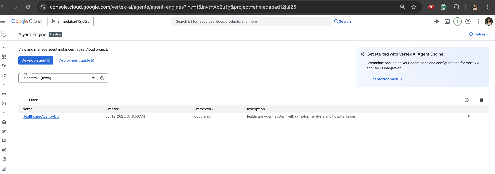
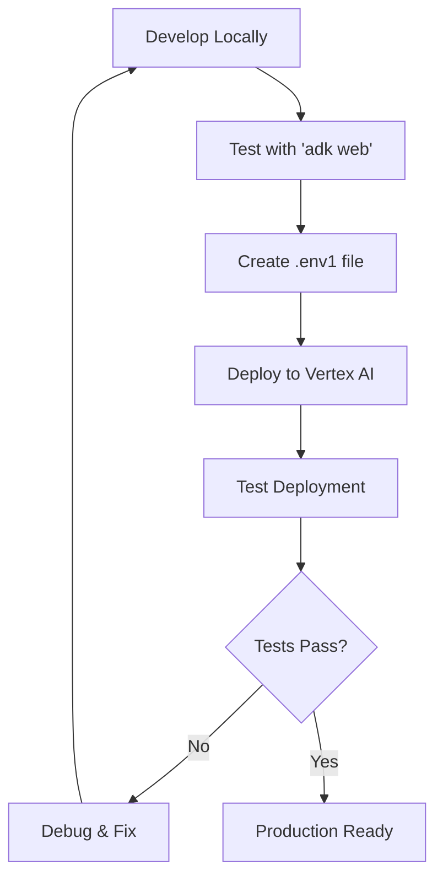

# Healthcare Agent Deployment Guide

A comprehensive guide for deploying the Healthcare Agent System to Google Cloud Vertex AI using the ADK (Agent Development Kit).

## 📋 Table of Contents

1. [Prerequisites](#prerequisites)
2. [Configuration Setup](#configuration-setup)
3. [Deployment Commands](#deployment-commands)
4. [Testing Your Deployment](#testing-your-deployment)
5. [Managing Deployments](#managing-deployments)
6. [Troubleshooting](#troubleshooting)
7. [Best Practices](#best-practices)

## 🚀 Prerequisites

### Initial Google Cloud Project Setup (First-time users)

If you're new to Google Cloud or haven't set up a project yet, follow these steps:

1.  **Create a Google Cloud Project:**
    *   Go to the [Google Cloud Console](https://console.cloud.google.com/).
    *   Click on the project selector dropdown (usually at the top left) and then "New Project".
    *   Give your project a name and select a billing account.
    *   Click "Create".

2.  **Enable Billing:**
    *   Ensure billing is enabled for your project. Go to "Billing" in the Cloud Console menu. If not enabled, follow the prompts to set it up. This is crucial for using Vertex AI and Google Places API.

3.  **Install Google Cloud CLI:**
    *   If you don't have it, install the [Google Cloud CLI](https://cloud.google.com/sdk/docs/install). This tool is essential for interacting with Google Cloud services from your terminal.
    *   After installation, initialize it: `gcloud init`

### Required Services

1. **Google Cloud Project** with billing enabled
2. **Vertex AI API** enabled
3. **Cloud Storage** bucket for staging
4. **Google Places API** enabled
5. **Python 3.9+** installed locally

### Required Permissions

Your Google Cloud account needs these IAM roles:
- `Vertex AI Administrator` or `Vertex AI User`
- `Storage Admin` or `Storage Object Admin`
- `Service Account User` 


## 🔧 Configuration Setup

### 1. Create .env1 File

Create a `.env1` file in your project root with the following configuration:

```env
# Google Cloud Configuration
GOOGLE_CLOUD_PROJECT=your-project-id
GOOGLE_CLOUD_LOCATION=us-central1
GOOGLE_CLOUD_STORAGE_BUCKET=your-staging-bucket

# API Keys
GOOGLE_PLACES_API_KEY=your-places-api-key
GOOGLE_API_KEY=your-google-ai-api-key

# Deployment Configuration
DEPLOYMENT_NAME=Healthcare-Agent-ADK
DEPLOYMENT_DESCRIPTION=Healthcare Agent System with symptom analysis, Home remdies suggester and hospital finder
```


### 2. Setting Up Google Cloud Resources

#### Create a Storage Bucket
```bash
# Replace YOUR_PROJECT_ID and YOUR_BUCKET_NAME
gsutil mb gs://YOUR_BUCKET_NAME
gsutil versioning set on gs://YOUR_BUCKET_NAME
```

#### Enable Required APIs
```bash
gcloud services enable aiplatform.googleapis.com
gcloud services enable storage.googleapis.com
gcloud services enable places-backend.googleapis.com
```

## 📦 Deployment Commands

### Create New Deployment

```bash
python deploy.py create
```

**Expected Output:**
```
🏥 Healthcare Agent Deployment System
==================================================
📋 Configuration:
   Project ID: your-project-id
   Location: us-central1
   Bucket: your-staging-bucket
   Deployment Name: Healthcare-Agent-ADK

🚀 Creating new healthcare agent deployment...
📋 Environment variables: ['GOOGLE_PLACES_API_KEY', 'GOOGLE_API_KEY']
✅ Created remote agent: projects/123456789/locations/us-central1/reasoningEngines/1234567890123456789
📋 Resource ID: 1234567890123456789

🎉 Deployment successful!
💡 To test: python deploy.py test 1234567890123456789
💡 To delete: python deploy.py delete 1234567890123456789
```

### Test Deployment

```bash
python deploy.py test <resource_id>
```

**Example:**
```bash
python deploy.py test 1234567890123456789
```

### Delete Deployment

```bash
python deploy.py delete <resource_id>
```

**Example:**
```bash
python deploy.py delete 1234567890123456789
```

## 🧪 Testing Your Deployment

### Vertex AI Agent Engine Dashboard


- Once your agent is deployed, you can find it listed under **Vertex AI > Agent Engine** in the Google Cloud Console.
- Clicking on the agent engine entry opens a detailed view where you can:
  - Monitor **telemetry** and **tracking logs** for debugging and performance insights.
  - View **resource allocation**, including CPU, memory, and scaling configuration.
  - Track the **active and historical sessions** handled by the agent.
  - Check the **deployment status** and any recent updates or errors.
  - Access configuration settings and endpoints for further integration.

> This view is essential for monitoring the health and usage of your deployed agent in production.

### Automated Test

The deployment script includes an automated test that sends a sample healthcare query:

```
"I have a fever and headache. Can you help me find nearby hospitals?"
```

### Manual Testing

You can also test your deployment manually using the Vertex AI console or by integrating with your applications.

### Expected Test Response

The healthcare agent should:
1. Analyze the symptoms (fever, headache)
2. Provide preliminary assessment
3. Find nearby hospitals using auto-location detection
4. Provide hospital details and emergency guidance

## 🛠️ Managing Deployments

### List Existing Deployments

```bash
gcloud ai reasoning-engines list --location=us-central1
```

### View Deployment Details

```bash
gcloud ai reasoning-engines describe RESOURCE_ID --location=us-central1
```

### Monitoring Your Deployment

After deployment, it's crucial to monitor your agent's performance and health.

#### 1. Monitor Deployment Logs

You can view logs generated by your deployed agent using Google Cloud Logging. This is essential for debugging and understanding your agent's behavior.

```bash
gcloud logging read "resource.type=vertex_ai_reasoning_engine" --limit=50 --project=YOUR_PROJECT_ID
```
Replace `YOUR_PROJECT_ID` with your actual Google Cloud Project ID. You can adjust the `--limit` to fetch more or fewer log entries.

#### 2. Vertex AI Agent Engine Dashboard

As mentioned in the "Testing Your Deployment" section, the Vertex AI Agent Engine Dashboard provides a comprehensive overview of your deployed agent.

*   Navigate to **Vertex AI > Agent Engine** in the Google Cloud Console.
*   Select your deployed agent to view:
    *   **Telemetry and Tracking Logs**: For debugging and performance insights.
    *   **Resource Allocation**: CPU, memory, and scaling configuration.
    *   **Active and Historical Sessions**: Track user interactions.
    *   **Deployment Status**: Check for updates or errors.
    *   **Configuration Settings and Endpoints**: For integration.

#### 3. Set Up Alerts

Configure custom alerts in Google Cloud Monitoring to be notified of critical events, such as:

*   High error rates
*   Increased latency
*   Resource utilization spikes

### Update Deployment

To update an existing deployment:
1. Delete the old deployment
2. Create a new deployment with updated code

```bash
python deploy.py delete <old_resource_id>
python deploy.py create
```

## 🔍 Troubleshooting

This section provides solutions to common issues you might encounter during deployment.

### Common Issues and Solutions

#### 1. Missing `.env1` File

*   **Error:** `❌ .env1 file not found!`
*   **Cause:** The deployment script cannot find the `.env1` configuration file.
*   **Solution:** Create a `.env1` file in the root directory of your project. You can use `.env1.template` as a starting point. Ensure all required variables are present and correctly configured.

#### 2. Missing or Incorrect Environment Variables

*   **Error:** `❌ Missing required environment variables in .env1` or unexpected behavior during deployment.
*   **Cause:** Essential environment variables (e.g., `GOOGLE_CLOUD_PROJECT`, `GOOGLE_PLACES_API_KEY`) are either missing from `.env1` or have incorrect values.
*   **Solution:** Double-check your `.env1` file. Ensure all variables listed in the "Configuration Setup" section are present and populated with the correct values for your Google Cloud project and API keys.

#### 3. Permission Denied Errors (`403 Forbidden`)

*   **Error:** `403 Forbidden` or other permission-related errors during `gcloud` commands or deployment.
*   **Cause:** Your authenticated Google Cloud account lacks the necessary IAM permissions to perform the requested actions (e.g., create Vertex AI resources, access Cloud Storage).
*   **Solution:**
    1.  **Verify Authentication:** Run `gcloud auth list` to confirm you are authenticated with the correct account. If not, use `gcloud auth login`.
    2.  **Check IAM Permissions:** Ensure your Google Cloud account (or the service account used for deployment) has the following IAM roles:
        *   `Vertex AI Administrator` or `Vertex AI User`
        *   `Storage Admin` or `Storage Object Admin`
        *   `Service Account User`
    3.  **Billing Enabled:** Confirm that billing is enabled for your Google Cloud project. Many services, including Vertex AI, require an active billing account.

#### 4. API Not Enabled Errors

*   **Error:** Messages like `API not enabled` for `aiplatform.googleapis.com`, `storage.googleapis.com`, or `places-backend.googleapis.com`.
*   **Cause:** The required Google Cloud APIs are not activated in your project.
*   **Solution:** Enable the necessary APIs using the `gcloud services enable` command:
    ```bash
    gcloud services enable aiplatform.googleapis.com
    gcloud services enable storage.googleapis.com
    gcloud services enable places-backend.googleapis.com
    ```
    You can also enable them via the Google Cloud Console.

#### 5. Cloud Storage Staging Bucket Issues

*   **Error:** `Bucket not found` or `Access denied` when the deployment script tries to use the staging bucket.
*   **Cause:** The specified Cloud Storage bucket (`GOOGLE_CLOUD_STORAGE_BUCKET` in `.env1`) does not exist, is in a different project, or your account lacks permissions to access it.
*   **Solution:**
    1.  **Create the Bucket:** If the bucket doesn't exist, create it:
        ```bash
        gsutil mb gs://YOUR_BUCKET_NAME
        ```
        Replace `YOUR_BUCKET_NAME` with the name specified in your `.env1` file.
    2.  **Enable Versioning (Recommended):**
        ```bash
        gsutil versioning set on gs://YOUR_BUCKET_NAME
        ```
    3.  **Verify Project and Permissions:** Ensure the bucket is in the same Google Cloud project you are deploying to and that your account has `Storage Admin` or `Storage Object Admin` roles for that bucket.

### Debug Mode

To get more detailed output and logs during the deployment process, you can enable debug mode in the `deploy.py` script. This can help pinpoint the exact cause of issues.

```python
# In deploy.py, add this to the beginning of the main() function
import logging
logging.basicConfig(level=logging.DEBUG)
```
This will print extensive debug information to your console, which can be invaluable for diagnosing complex problems.


## 📚 Best Practices

### 1. Environment Management

- **Use separate .env1 files** for different environments (dev, staging, prod)
- **Never commit .env1 files** to version control
- **Use descriptive deployment names** to identify different versions

### 2. Security

- **Restrict API key access** to only required services
- **Use service accounts** for production deployments
- **Regularly rotate API keys** and credentials

### 3. Cost Management

- **Monitor usage** through Google Cloud Console
- **Set up billing alerts** for unexpected costs
- **Delete unused deployments** to avoid ongoing charges

### 4. Deployment Lifecycle

- **Test locally first** before deploying to Vertex AI
- **Use staging environments** for testing
- **Keep deployment logs** for troubleshooting
- **Document deployment versions** and changes

### 5. Monitoring and Maintenance

- **Set up monitoring** for deployment health
- **Regular health checks** using the test command
- **Monitor API quotas** and usage limits
- **Keep dependencies updated** in requirements

## 🔄 Deployment Workflow

### Development Workflow


```mermaid
graph TD
    A[Develop Locally] --> B[Test with 'adk web']
    B --> C[Create .env1 file]
    C --> D[Deploy to Vertex AI]
    D --> E[Test Deployment]
    E --> F{Tests Pass?}
    F -->|No| G[Debug & Fix]
    G --> A
    F -->|Yes| H[Production Ready]
```

## 📊 Resource Requirements

### API Quotas

- **Vertex AI:** Check your project quotas
- **Google Places API:** Monitor usage and set limits
- **Google AI/Gemini:** Monitor token usage


### Useful Links

- [Vertex AI Documentation](https://cloud.google.com/vertex-ai/docs)
- [Google Cloud Console](https://console.cloud.google.com/)
- [Google Places API Documentation](https://developers.google.com/maps/documentation/places/web-service)
- [ADK Documentation](https://cloud.google.com/vertex-ai/generative-ai/docs/agent-development-kit/quickstart)

---

## 📝 Quick Reference

### Command Summary

```bash
# Create deployment
python deploy.py create

# Test deployment
python deploy.py test <resource_id>

# Delete deployment
python deploy.py delete <resource_id>

# List deployments
gcloud ai reasoning-engines list --location=us-central1

# View logs
gcloud logging read "resource.type=vertex_ai_reasoning_engine" --limit=50
```

---

**Remember:** Always test your deployment after creation to ensure it's working correctly. Keep your `.env1` file secure and never commit it to version control. 